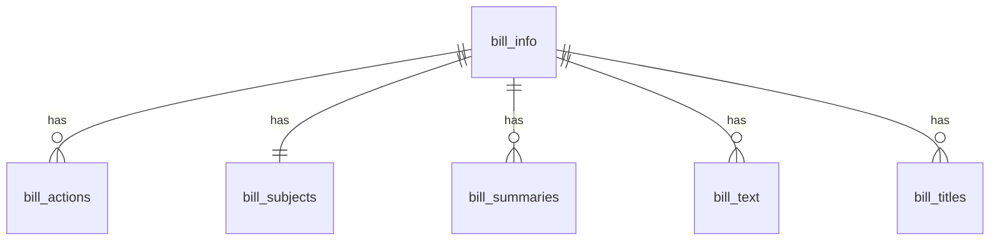

# Data Management

## Database Schema

### Core Tables Overview

The database is structured around a central `bill_info` table with several related tables containing specific aspects of bills. All related tables use the bill's ID as a foreign key, creating a hub-and-spoke model where `bill_info` is the hub.

### Table Relationships

### Table Structures

#### 1. Bill Info (`bill_info`)
Primary table containing core bill information.

**Primary Key**: `id` (TEXT)

| Column | Type | Description | Example |
|--------|------|-------------|----------|
| id | TEXT | Unique identifier formatted as {number}{type}{congress} | "114hr118" |
| introduced_date | DATE | Date bill was introduced | "2023-01-09" |
| sponsor_bioguide_id | TEXT | Sponsor's bioguide ID | "B001302" |
| sponsor_district | INTEGER | Sponsor's district number | 5 |
| sponsor_first_name | TEXT | Sponsor's first name | "Andy" |
| sponsor_last_name | TEXT | Sponsor's last name | "Biggs" |
| sponsor_party | TEXT | Sponsor's party | "R" |
| sponsor_state | TEXT | Sponsor's state | "AZ" |
| sponsor_is_by_request | TEXT | If bill was by request | "N" |
| update_date | TIMESTAMP WITH TIME ZONE | Last update date | "2024-06-11T15:57:35Z" |
| update_date_including_text | TIMESTAMP WITH TIME ZONE | Last update including text changes | "2024-06-11T15:57:35Z" |
| created_at | TIMESTAMP WITH TIME ZONE | Record creation timestamp | Auto-generated |
| updated_at | TIMESTAMP WITH TIME ZONE | Record update timestamp | Auto-generated |

#### 2. Bill Actions (`bill_actions`)
Contains all actions taken on a bill.

**Primary Key**: Composite (`id`, `action_code`, `action_date`)
**Foreign Key**: `id` references `bill_info(id)`

| Column | Type | Description | Example |
|--------|------|-------------|----------|
| id | TEXT | References bill_info(id) | "114hr118" |
| action_code | TEXT | Unique code for the action | "36000" |
| action_date | DATE | Date of the action | "2022-04-06" |
| source_system_code | INTEGER | System code for action source | 9 |
| source_system_name | TEXT | Name of source system | "Library of Congress" |
| text | TEXT | Description of the action | "Became Public Law No: 117-108." |
| type | TEXT | Type of action | "BecameLaw" |
| created_at | TIMESTAMP WITH TIME ZONE | Record creation timestamp | Auto-generated |
| updated_at | TIMESTAMP WITH TIME ZONE | Record update timestamp | Auto-generated |

#### 3. Bill Subjects (`bill_subjects`)
Contains policy area information for each bill.

**Primary Key**: `id`
**Foreign Key**: `id` references `bill_info(id)`

| Column | Type | Description | Example |
|--------|------|-------------|----------|
| id | TEXT | References bill_info(id) | "114hr118" |
| policy_area_name | TEXT | Name of policy area | "Government Operations and Politics" |
| policy_area_update_date | TIMESTAMP WITH TIME ZONE | Last update of policy area | "2023-01-19T23:47:02Z" |
| created_at | TIMESTAMP WITH TIME ZONE | Record creation timestamp | Auto-generated |
| updated_at | TIMESTAMP WITH TIME ZONE | Record update timestamp | Auto-generated |

#### 4. Bill Summaries (`bill_summaries`)
Contains different versions of bill summaries.

**Primary Key**: Composite (`id`, `version_code`)
**Foreign Key**: `id` references `bill_info(id)`

| Column | Type | Description | Example |
|--------|------|-------------|----------|
| id | TEXT | References bill_info(id) | "114hr118" |
| action_date | DATE | Date of summary action | "2023-01-09" |
| action_desc | TEXT | Description of summary action | "Introduced in House" |
| text | TEXT | Summary text content | HTML formatted text |
| update_date | TIMESTAMP WITH TIME ZONE | Last update timestamp | "2023-01-20T19:19:57Z" |
| version_code | TEXT | Version identifier | "00" |
| created_at | TIMESTAMP WITH TIME ZONE | Record creation timestamp | Auto-generated |
| updated_at | TIMESTAMP WITH TIME ZONE | Record update timestamp | Auto-generated |

#### 5. Bill Text (`bill_text`)
Contains links to different versions of bill text.

**Primary Key**: Composite (`id`, `date`, `type`)
**Foreign Key**: `id` references `bill_info(id)`

| Column | Type | Description | Example |
|--------|------|-------------|----------|
| id | TEXT | References bill_info(id) | "114hr118" |
| date | TIMESTAMP WITH TIME ZONE | Version date | "2023-01-09T05:00:00Z" |
| formats_url_txt | TEXT | URL to HTML version | "https://..." |
| formats_url_pdf | TEXT | URL to PDF version | "https://..." |
| type | TEXT | Version type | "Introduced in House" |
| created_at | TIMESTAMP WITH TIME ZONE | Record creation timestamp | Auto-generated |
| updated_at | TIMESTAMP WITH TIME ZONE | Record update timestamp | Auto-generated |

#### 6. Bill Titles (`bill_titles`)
Contains different titles associated with bills.

**Primary Key**: Composite (`id`, `title_type_code`, `title`)
**Foreign Key**: `id` references `bill_info(id)`

| Column | Type | Description | Example |
|--------|------|-------------|----------|
| id | TEXT | References bill_info(id) | "114hr118" |
| title | TEXT | The title text | "Postal Service Reform Act of 2022" |
| title_type | TEXT | Type of title | "Display Title" |
| title_type_code | INTEGER | Code for title type | 45 |
| update_date | TIMESTAMP WITH TIME ZONE | Last update timestamp | "2023-01-11T13:49:52Z" |
| bill_text_version_code | TEXT | Optional version code | "RH" |
| bill_text_version_name | TEXT | Optional version name | "Reported in House" |
| chamber_code | TEXT | Optional chamber code | "H" |
| chamber_name | TEXT | Optional chamber name | "House" |
| created_at | TIMESTAMP WITH TIME ZONE | Record creation timestamp | Auto-generated |
| updated_at | TIMESTAMP WITH TIME ZONE | Record update timestamp | Auto-generated |

### Common Features Across Tables

1. **Timestamps**
   - All tables include `created_at` and `updated_at` columns
   - Auto-managed by triggers for tracking record history

2. **Row Level Security (RLS)**
   - All tables have RLS enabled
   - Read access for authenticated users
   - Write access restricted to service role

3. **Indexing Strategy**
   - Primary key columns are automatically indexed
   - Foreign key columns have dedicated indexes
   - Additional indexes on frequently queried columns

4. **Cascade Deletion**
   - All child tables have ON DELETE CASCADE
   - Deleting from bill_info cascades to all related records

### Data Integrity

1. **Primary Keys**
   - `bill_info`: Single column (id)
   - Other tables: Composite keys including id
   - Ensures unique identification of records

2. **Foreign Keys**
   - All tables reference bill_info(id)
   - Enforces referential integrity
   - Prevents orphaned records

3. **NOT NULL Constraints**
   - Applied to essential columns
   - Ensures data completeness
   - Maintains data quality

### Performance Considerations

1. **Indexes**
   - Strategic indexing for common queries
   - Foreign key indexes for joins
   - Composite indexes where needed

2. **Denormalization**
   - Some redundant data for performance
   - Balanced with data integrity needs
   - Optimized for read operations

### Security Model

1. **Row Level Security**
   - Read: Authenticated users
   - Write: Service role only
   - Policies defined per table

2. **Service Role Access**
   - Used for data synchronization
   - Bypasses RLS for maintenance
   - Controlled access pattern

### API Integration Details

1. Congress.gov API
   - Base URL: `https://api.congress.gov/v3`
   - Authentication: API key required
   - Rate limit: 5,000 requests/hour
   - Response format: JSON

2. Endpoints Used
   - Parameters:
     - `limit`: Records per page (max 250)
     - `offset`: Pagination offset
     - `format`: Response format (json)
     - `api_key`: Authentication

### Data Quality Assurance

1. Validation Checks
   - Required fields presence
   - Data type consistency
   - Format compliance
   - Relationship integrity

2. Data Cleaning
   - Sponsor name formatting
   - Date standardization
   - Text field sanitization
   - Empty field handling

3. Monitoring Metrics
   - Sync completion rate
   - Error frequency
   - Data freshness
   - Coverage completeness

### Security Considerations

1. Authentication
   - API key protection
   - Sync token requirement
   - Environment variable security

2. Access Control
   - Row Level Security (RLS)
   - Role-based access
   - API rate limiting
   - Request validation

3. Data Protection
   - Sensitive data handling
   - Audit logging
   - Error masking
   - Secure connections

## API Integration

### Congress.gov API
- Rate limit: 5,000 requests per hour
- Maximum batch size: 250 records
- Supports XML and JSON formats
- Authentication via API key

### Data Flow
1. Congress.gov API → Sync Scripts
2. Data Transformation & Validation
3. Supabase Storage (upsert operations)
4. Client Access via Next.js API Routes

## Recent Changes

### Database Updates
- Added `status_history` for tracking bill progression
- Implemented progress calculation
- Added vote counting
- Enhanced indexing for performance

### API Improvements
- Rate limit handling
- Batch processing
- Error recovery
- Progress tracking

### UI Enhancements
- Responsive design optimization
- Accessibility improvements
- Performance optimizations
- Enhanced filtering and search

## Data Access Patterns

### Server Components
- Direct Supabase queries
- Pre-rendered content
- SEO optimization

### Client Components
- Real-time updates
- Interactive features
- Cached data access

## Security & Performance

### Security Measures
- Row Level Security (RLS) enabled
- API key protection
- Rate limiting
- Input validation

### Performance Optimizations
- Indexed queries
- Batch processing
- Incremental Static Regeneration
- Edge caching