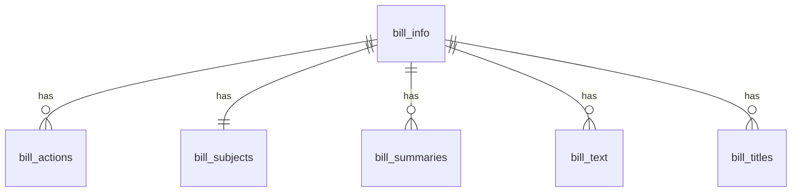
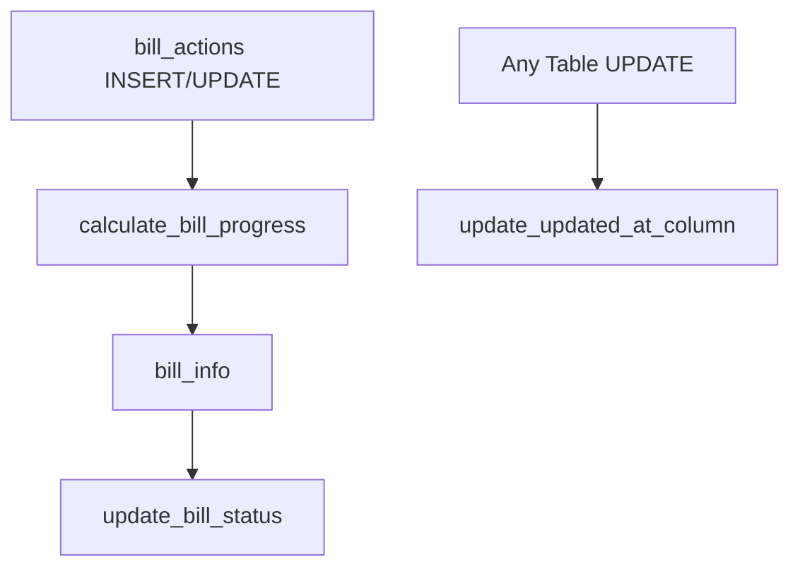

# Data Management

## Service Layer

### BillsService

The `billsService` object is responsible for handling all bill-related data operations. It provides a clean interface for fetching and transforming bill data from our Supabase database.

```typescript
export const billsService = {
  getClient(): SupabaseClient {
    // Creates and returns Supabase client
  },

  async fetchBills(params: BillQueryParams): Promise<BillsResponse> {
    // Fetches bills with filtering, pagination, and sorting
  },

  async fetchBillById(id: string): Promise<Bill> {
    // Fetches single bill with related data (summaries, text, subjects)
  },

  async getCongressInfo(): Promise<{ congress: number; startYear: number; endYear: number }> {
    // Gets current Congress info and calculates session years
  }
};
```

### Query Parameters

```typescript
interface BillQueryParams {
  page?: number;
  itemsPerPage?: number;
  status?: string | null;
  introducedDateFilter?: string | null;
  lastActionDateFilter?: string | null;
  sponsorFilter?: string;
  titleFilter?: string;
  stateFilter?: string | null;
  policyArea?: string | null;
  billType?: string | null;
}
```

### Congress Session Information

The application dynamically calculates and displays Congress session years:

1. **Data Source**
   - Fetches latest Congress number from `bill_info` table
   - Each Congress starts on January 3rd of odd-numbered years
   - Each Congress lasts for 2 years

2. **Calculation Logic**
   ```typescript
   // Example: 118th Congress
   const startYear = 2023 + (congress - 118) * 2;
   const endYear = startYear + 2;
   ```

3. **Display Format**
   - Shows year range: (2023–2025)
   - Updates automatically with data changes
   - Handles historical and future Congress sessions

### Bill Details

The bill detail view includes:

1. **PDF Access**
   - Fetches latest PDF URL from `bill_text` table
   - Opens in new tab for better user experience
   - Maintains state between navigation

2. **Party Information**
   - Extended party mappings:
     ```typescript
     const PARTY_NAMES = {
       R: 'Republican',
       D: 'Democrat',
       I: 'Independent',
       ID: 'Independent Democrat',
       IR: 'Independent Republican',
       L: 'Libertarian',
       G: 'Green Party',
       '': 'No Party Affiliation'
     };
     ```

3. **Progress Calculation**
   - Uses normalized stages (20-100)
   - Converts to percentage for display
   - Visual indicators for each stage

### Bill Filtering

The application supports multiple filtering mechanisms:

1. **Status Filters**
   - Filter by bill progress (Introduced, In Committee, etc.)
   - Uses exact matching with progress_description

2. **Date Filters**
   - Introduced Date: Filter bills by when they were introduced
   - Last Action Date: Filter by most recent activity
   - Options: Last Week, Last Month, Last Year

3. **Text Search**
   - Title Search: Search within bill titles (case-insensitive, handles multiple words)
   - Sponsor Search: Search by legislator name (supports partial matches, space-aware)

4. **Category Filters**
   - Policy Area: Filter by specific policy categories
   - State: Filter by sponsor's state
   - Bill Type: Filter by bill type with full descriptions
   
All filters can be combined and cleared using the "Clear All Filters" button.
Filter states persist across sessions using localStorage.

### Database Functions for Filtering

To optimize certain filtering operations, we use database functions. These functions are implemented as stored procedures in Supabase and provide better performance than client-side filtering.

1. **Congress Numbers Function**
   ```sql
   -- Function to get distinct congress numbers
   CREATE OR REPLACE FUNCTION get_distinct_congress_numbers()
   RETURNS integer[] 
   LANGUAGE sql
   SECURITY DEFINER
   AS $$
       SELECT ARRAY(
           SELECT DISTINCT congress 
           FROM bill_info 
           WHERE congress IS NOT NULL 
           ORDER BY congress DESC
       );
   $$;

   -- Grant necessary permissions
   GRANT EXECUTE ON FUNCTION get_distinct_congress_numbers() TO anon;
   GRANT EXECUTE ON FUNCTION get_distinct_congress_numbers() TO authenticated;
   GRANT EXECUTE ON FUNCTION get_distinct_congress_numbers() TO public;
   ```

   - Uses `SECURITY DEFINER` to ensure consistent permissions
   - Returns an ordered array of unique congress numbers
   - Accessible to all user roles
   - Called via Supabase RPC: `supabase.rpc('get_distinct_congress_numbers')`

2. **Implementation in BillsService**
   ```typescript
   async getAvailableCongressNumbers(): Promise<number[]> {
     const { data, error } = await supabase
       .rpc('get_distinct_congress_numbers');

     if (error) throw new Error(error.message);
     return data || [];
   }
   ```

3. **Congress Filter Implementation**
   ```typescript
   // In fetchBills function
   if (congress && congress !== 'all') {
     const congressNum = parseInt(congress, 10);
     if (!isNaN(congressNum)) {
       query = query.eq('congress', congressNum);
     }
   }
   ```

4. **Best Practices for Creating Filter Functions**
   - Use `SECURITY DEFINER` for consistent permissions
   - Return strongly typed arrays or records
   - Grant appropriate permissions to all necessary roles
   - Add input validation where necessary
   - Use parameterized queries to prevent SQL injection
   - Consider adding indexes for frequently filtered columns

5. **Performance Considerations**
   - Database functions reduce network overhead
   - Avoid complex joins in functions when possible
   - Use appropriate indexes on filtered columns
   - Consider caching for relatively static data
   - Monitor function execution time and optimize as needed

### Response Types

```typescript
interface BillsResponse {
  data: Bill[];
  count: number;
}

interface Bill {
  id: string;
  congress: number;
  bill_type: string;
  bill_number: string;
  bill_type_label: string;
  introduced_date: string;
  title: string;
  sponsor_first_name: string;
  sponsor_last_name: string;
  sponsor_party: string;
  sponsor_state: string;
  progress_stage: string;
  progress_description: string;
  bill_subjects?: {
    policy_area_name: string;
  };
  latest_summary?: string;
  pdf_url?: string;
}
```

## Database Schema

### Core Tables Overview

The database is structured around a central `bill_info` table with several related tables containing specific aspects of bills. All related tables use the bill's ID as a foreign key, creating a hub-and-spoke model where `bill_info` is the hub.

### Table Relationships



### Table Structures

#### 1. Bill Info (`bill_info`)
Primary table containing core bill information.

**Primary Key**: `id` (TEXT)

| Column | Type | Description | Example |
|--------|------|-------------|----------|
| id | TEXT | Unique identifier formatted as {number}{type}{congress} | "114hr118" |
| introduced_date | DATE | Date bill was introduced | "2023-01-09" |
| sponsor_bioguide_id | TEXT | Sponsor's bioguide ID | "B001302" |
| sponsor_district | INTEGER | Sponsor's district number | 5 |
| sponsor_first_name | TEXT | Sponsor's first name | "Andy" |
| sponsor_last_name | TEXT | Sponsor's last name | "Biggs" |
| sponsor_party | TEXT | Sponsor's party | "R" |
| sponsor_state | TEXT | Sponsor's state | "AZ" |
| sponsor_is_by_request | TEXT | If bill was by request | "N" |
| update_date | TIMESTAMP WITH TIME ZONE | Last update date | "2024-06-11T15:57:35Z" |
| update_date_including_text | TIMESTAMP WITH TIME ZONE | Last update including text changes | "2024-06-11T15:57:35Z" |
| created_at | TIMESTAMP WITH TIME ZONE | Record creation timestamp | Auto-generated |
| updated_at | TIMESTAMP WITH TIME ZONE | Record update timestamp | Auto-generated |
| latest_action_code | TEXT | The most recent action code from the bill's legislative history | "36000" |
| latest_action_date | DATE | The date of the most recent action taken on the bill | "2024-06-11" |
| latest_action_text | TEXT | A description of the most recent action taken on the bill | "Passed in House" |
| progress_stage | INTEGER | The current stage of the bill in the legislative process | 60 |
| progress_description | TEXT | A textual description of the bill's progress | "Passed First Chamber" |

#### 2. Bill Actions (`bill_actions`)
Contains all actions taken on a bill.

**Primary Key**: Composite (`id`, `action_code`, `action_date`)
**Foreign Key**: `id` references `bill_info(id)`

| Column | Type | Description | Example |
|--------|------|-------------|----------|
| id | TEXT | References bill_info(id) | "114hr118" |
| action_code | TEXT | Unique code for the action | "36000" |
| action_date | DATE | Date of the action | "2022-04-06" |
| source_system_code | INTEGER | System code for action source | 9 |
| source_system_name | TEXT | Name of source system | "Library of Congress" |
| text | TEXT | Description of the action | "Became Public Law No: 117-108." |
| type | TEXT | Type of action | "BecameLaw" |
| created_at | TIMESTAMP WITH TIME ZONE | Record creation timestamp | Auto-generated |
| updated_at | TIMESTAMP WITH TIME ZONE | Record update timestamp | Auto-generated |

#### 4. Bill Subjects (`bill_subjects`)
Contains policy area information for each bill.

**Primary Key**: `id`
**Foreign Key**: `id` references `bill_info(id)`

| Column | Type | Description | Example |
|--------|------|-------------|----------|
| id | TEXT | References bill_info(id) | "114hr118" |
| policy_area_name | TEXT | Name of the policy area | "Health" |
| policy_area_update_date | TIMESTAMP WITH TIME ZONE | Last update timestamp | "2023-01-11T13:49:52Z" |
| created_at | TIMESTAMP WITH TIME ZONE | Record creation timestamp | Auto-generated |
| updated_at | TIMESTAMP WITH TIME ZONE | Record update timestamp | Auto-generated |

The `bill_subjects` table has a one-to-one relationship with `bill_info`, meaning each bill has exactly one policy area. This design choice reflects that Congress.gov assigns one primary policy area to each bill.

#### 5. Bill Summaries (`bill_summaries`)
Contains different versions of bill summaries.

**Primary Key**: Composite (`id`, `version_code`)
**Foreign Key**: `id` references `bill_info(id)`

| Column | Type | Description | Example |
|--------|------|-------------|----------|
| id | TEXT | References bill_info(id) | "114hr118" |
| action_date | DATE | Date of summary action | "2023-01-09" |
| action_desc | TEXT | Description of summary action | "Introduced in House" |
| text | TEXT | Summary text content | HTML formatted text |
| update_date | TIMESTAMP WITH TIME ZONE | Last update timestamp | "2023-01-20T19:19:57Z" |
| version_code | TEXT | Version identifier | "00" |
| created_at | TIMESTAMP WITH TIME ZONE | Record creation timestamp | Auto-generated |
| updated_at | TIMESTAMP WITH TIME ZONE | Record update timestamp | Auto-generated |

#### 6. Bill Text (`bill_text`)
Contains links to different versions of bill text.

**Primary Key**: Composite (`id`, `date`, `type`)
**Foreign Key**: `id` references `bill_info(id)`

| Column | Type | Description | Example |
|--------|------|-------------|----------|
| id | TEXT | References bill_info(id) | "114hr118" |
| date | TIMESTAMP WITH TIME ZONE | Version date | "2023-01-09T05:00:00Z" |
| formats_url_txt | TEXT | URL to HTML version | "https://..." |
| formats_url_pdf | TEXT | URL to PDF version | "https://..." |
| type | TEXT | Version type | "Introduced in House" |
| created_at | TIMESTAMP WITH TIME ZONE | Record creation timestamp | Auto-generated |
| updated_at | TIMESTAMP WITH TIME ZONE | Record update timestamp | Auto-generated |

#### 7. Bill Titles (`bill_titles`)
Contains different titles associated with bills.

**Primary Key**: Composite (`id`, `title_type_code`, `title`)
**Foreign Key**: `id` references `bill_info(id)`

| Column | Type | Description | Example |
|--------|------|-------------|----------|
| id | TEXT | References bill_info(id) | "114hr118" |
| title | TEXT | The title text | "Postal Service Reform Act of 2022" |
| title_type | TEXT | Type of title | "Display Title" |
| title_type_code | INTEGER | Code for title type | 45 |
| update_date | TIMESTAMP WITH TIME ZONE | Last update timestamp | "2023-01-11T13:49:52Z" |
| bill_text_version_code | TEXT | Optional version code | "RH" |
| bill_text_version_name | TEXT | Optional version name | "Reported in House" |
| chamber_code | TEXT | Optional chamber code | "H" |
| chamber_name | TEXT | Optional chamber name | "House" |
| created_at | TIMESTAMP WITH TIME ZONE | Record creation timestamp | Auto-generated |
| updated_at | TIMESTAMP WITH TIME ZONE | Record update timestamp | Auto-generated |

### Common Features Across Tables

1. **Timestamps**
   - All tables include `created_at` and `updated_at` columns
   - Auto-managed by triggers for tracking record history

2. **Row Level Security (RLS)**
   - All tables have RLS enabled
   - Read access for authenticated users
   - Write access restricted to service role

3. **Indexing Strategy**
   - Primary key columns are automatically indexed
   - Foreign key columns have dedicated indexes
   - Additional indexes on frequently queried columns

4. **Cascade Deletion**
   - All child tables have ON DELETE CASCADE
   - Deleting from bill_info cascades to all related records

### Data Integrity

1. **Primary Keys**
   - `bill_info`: Single column (id)
   - Other tables: Composite keys including id
   - Ensures unique identification of records

2. **Foreign Keys**
   - All tables reference bill_info(id)
   - Enforces referential integrity
   - Prevents orphaned records

3. **NOT NULL Constraints**
   - Applied to essential columns
   - Ensures data completeness
   - Maintains data quality

### Performance Considerations

1. **Indexes**
   - Strategic indexing for common queries
   - Foreign key indexes for joins
   - Composite indexes where needed

2. **Denormalization**
   - Some redundant data for performance
   - Balanced with data integrity needs
   - Optimized for read operations

### Security Model

1. **Row Level Security**
   - Read: Authenticated users
   - Write: Service role only
   - Policies defined per table

2. **Service Role Access**
   - Used for data synchronization
   - Bypasses RLS for maintenance
   - Controlled access pattern

### API Integration Details

1. Congress.gov API
   - Base URL: `https://api.congress.gov/v3`
   - Authentication: API key required
   - Rate limit: 5,000 requests/hour
   - Response format: JSON

2. Endpoints Used
   - Parameters:
     - `limit`: Records per page (max 250)
     - `offset`: Pagination offset
     - `format`: Response format (json)
     - `api_key`: Authentication

### Data Quality Assurance

1. Validation Checks
   - Required fields presence
   - Data type consistency
   - Format compliance
   - Relationship integrity

2. Data Cleaning
   - Sponsor name formatting
   - Date standardization
   - Text field sanitization
   - Empty field handling

3. Monitoring Metrics
   - Sync completion rate
   - Error frequency
   - Data freshness
   - Coverage completeness

### Security Considerations

1. Authentication
   - API key protection
   - Sync token requirement
   - Environment variable security

2. Access Control
   - Row Level Security (RLS)
   - Role-based access
   - API rate limiting
   - Request validation

3. Data Protection
   - Sensitive data handling
   - Audit logging
   - Error masking
   - Secure connections

## API Integration

### Congress.gov API
- Rate limit: 5,000 requests per hour
- Maximum batch size: 250 records
- Supports XML and JSON formats
- Authentication via API key

### Data Flow
1. Congress.gov API → Sync Scripts
2. Data Transformation & Validation
3. Supabase Storage (upsert operations)
4. Client Access via Next.js API Routes

## Recent Changes

### Database Updates
- Added `status_history` for tracking bill progression
- Implemented progress calculation
- Added vote counting
- Enhanced indexing for performance

### API Improvements
- Rate limit handling
- Batch processing
- Error recovery
- Progress tracking

### UI Enhancements
- Responsive design optimization
- Accessibility improvements
- Performance optimizations
- Enhanced filtering and search

## Data Access Patterns

### Server Components
- Direct Supabase queries
- Pre-rendered content
- SEO optimization

### Client Components
- Real-time updates
- Interactive features
- Cached data access

## Security & Performance

### Security Measures
- Row Level Security (RLS) enabled
- API key protection
- Rate limiting
- Input validation

### Performance Optimizations
- Indexed queries
- Batch processing
- Incremental Static Regeneration
- Edge caching

## Status Tracking System

The bill status tracking system uses several components:

1. **Action Codes**: Numeric codes in `bill_actions` table that indicate specific legislative actions. We handle multiple source systems:
   - Library of Congress (source_system_code = 9)
   - House Floor Actions (source_system_code = 2)
   - Senate Floor Actions (source_system_code = 3)

2. **Progress Stages**:
   - 20: Introduced (0%)
   - 40: In Committee (20%)
   - 60: Passed One Chamber (40%)
   - 70: Passed Both Chambers (60%)
   - 80: To President (80%)
   - 90: Signed by President (90%)
   - 100: Became Law (100%)

3. **Database Trigger Implementation**: 
   - A trigger function `calculate_bill_progress()` runs after any insert or update on `bill_actions`
   - The trigger:
     - Finds the latest action for the bill
     - Determines the progress stage based on action codes, types, and text
     - Updates `progress_stage` and `progress_description` in `bill_info`

4. **Status Calculation Logic**:
   The bill status is automatically calculated through a database trigger that fires when actions are inserted or updated in the `bill_actions` table. The status is determined by examining action codes and source systems in the following priority order:

   1. **Became Law (Stage 100)**
      - Library of Congress: Action codes `36000`, `E40000`
      - Or type = 'BecameLaw'
      - Or text contains 'Became Public Law'
      - Description: "Became Law"

   2. **Signed by President (Stage 90)**
      - Library of Congress: Action codes `29000`, `E30000`
      - Or text contains 'Signed by President'
      - Description: "Signed by President"

   3. **To President (Stage 80)**
      - Library of Congress: Action codes `28000`, `E20000`
      - Or text contains 'Presented to President'
      - Description: "To President"

   4. **Passed Both Chambers (Stage 70)**
      - House Passage:
        - Library of Congress: Action code `8000`
        - Or House Floor: Action codes `H38310`, `H37300`
        - Or text contains 'Passed the House'
      - AND Senate Passage:
        - Library of Congress: Action code `17000`
        - Or text contains 'Passed Senate'
      - Description: "Passed Both Chambers"

   5. **Passed One Chamber (Stage 60)**
      - Either House Passage OR Senate Passage (same conditions as above)
      - Description: "Passed One Chamber"

   6. **In Committee (Stage 40)**
      - Library of Congress: Action codes `5000`, `14000`
      - Or type = 'Reported'
      - Description: "In Committee"

   7. **Introduced (Stage 20)**
      - Library of Congress: Action codes `1000`, `10000`
      - Or type = 'IntroReferral'
      - Or default stage if no other conditions are met
      - Description: "Introduced"

   The trigger function `calculate_bill_progress()` automatically updates two columns in the `bill_info` table:
   - `progress_stage`: Numeric value (20-100) indicating current stage
   - `progress_description`: Text description of the current stage

   This ensures consistent status calculation across the entire application and maintains accurate bill progress tracking based on actual legislative actions from multiple authoritative sources.

5. **Progress Stage to Percentage Mapping**:
   - Introduced (20) → 0%
   - In Committee (40) → 20%
   - Passed One Chamber (60) → 40%
   - Passed Both Chambers (70) → 60%
   - To President (80) → 80%
   - Signed by President (90) → 90%
   - Became Law (100) → 100%

6. **Data Flow**:
   - Bill actions are stored in `bill_actions` table
   - Status is automatically calculated by the trigger
   - No manual status updates needed
   - Status is always derived from actual actions
   - Multiple source systems are considered for comprehensive status tracking

This system ensures that bill status is:
- Automatically updated
- Consistently calculated
- Based on authoritative action codes from multiple sources
- Handles both Library of Congress and chamber-specific codes
- Validates actions through text content when needed

## Data Relationships

All tables have a one-to-many relationship with `bill_info` through the `id` column:
- One bill can have many actions
- One bill can have many titles
- One bill can have many subjects
- One bill can have many summaries
- One bill can have many text versions

## Caching and Data Fetching

### Supabase Integration

#### 1. Client Configuration
```typescript
// utils/supabase/client.ts
export const createClient = () => {
  return createSupabaseClient(url, key, {
    auth: {
      persistSession: false,
      autoRefreshToken: false,
    },
    global: {
      fetch: (url, init) => {
        const customInit = {
          ...init,
          next: { 
            revalidate: 3600,
            tags: ['bills']
          }
        };
        if (!init?.cache) {
          customInit.cache = 'force-cache';
        }
        return fetch(url, customInit);
      }
    }
  });
};
```

#### 2. Caching Strategy
- **Default Cache**: Force-cache for all requests
- **Cache Duration**: 1 hour (3600 seconds)
- **Cache Tags**: 'bills' for bill-related data
- **Cache Override**: Possible through init parameters

#### 3. Server Components Integration
```typescript
// Example of cached data fetching in a server component
const getCachedBillById = unstable_cache(
  async (id: string) => {
    'use server';
    const supabase = createClient();
    const { data, error } = await supabase
      .from('bill_info')
      .select('*')
      .eq('id', id)
      .single();
    return data;
  },
  ['bill-detail'],
  {
    revalidate: 3600,
    tags: ['bills']
  }
);
```

### Caching Patterns

#### 1. List Pages
- Cache entire result sets
- Revalidate hourly
- Use pagination metadata
- Cache by query parameters

#### 2. Detail Pages
- Cache individual records
- Dynamic route parameters
- Related data caching
- Nested relationship handling

#### 3. Search Results
- Cache common searches
- Partial cache invalidation
- Search parameter handling
- Result set management

### Performance Optimization

#### 1. Query Optimization
- Select specific columns
- Use appropriate indexes
- Optimize join operations
- Handle pagination efficiently

#### 2. Cache Management
- Granular cache invalidation
- Cache warming strategies
- Memory usage optimization
- Cache hit ratio monitoring

#### 3. Error Handling
- Graceful degradation
- Fallback strategies
- Error boundary implementation
- Cache miss handling

### Best Practices

#### 1. Data Fetching
- Use server components
- Implement proper caching
- Handle loading states
- Manage error states

#### 2. Cache Configuration
- Set appropriate TTL
- Use meaningful tags
- Implement cache warming
- Monitor cache performance

#### 3. Performance Monitoring
- Track cache hit rates
- Monitor response times
- Analyze query performance
- Measure client impact

## Data Fetching Strategy

### 1. Static Generation
- Pre-generates the most recent 100 bills at build time
- Uses ISR with 1-hour revalidation
- Optimizes performance for frequently accessed bills

### 2. Dynamic Data
- Fetches bill details on-demand for non-pre-generated bills
- Implements proper error handling
- Uses loading states for better UX

### 3. Caching
- Page-level caching with ISR
- Service layer caching for repeated requests
- Proper cookie handling in server components

## Error Handling

### 1. Service Layer
```typescript
try {
  const data = await this.supabase
    .from(BILL_INFO_TABLE_NAME)
    .select(...)
    .match({ id })
    .single();

  if (!data) {
    return null;
  }

  return data;
} catch (error) {
  console.error('Error fetching bill:', error);
  throw new Error('Failed to fetch bill data');
}
```

### 2. Component Layer
```typescript
try {
  const data = await getBillData(id);
  if (!data) {
    notFound();
  }
  // Render data
} catch (error) {
  // Show error UI
}
```

## Best Practices

### 1. Data Fetching
- Use service layer for all data operations
- Implement proper error handling
- Use TypeScript for type safety
- Handle loading states

### 2. Performance
- Implement ISR where appropriate
- Pre-generate static content
- Cache frequently accessed data
- Handle dynamic routes efficiently

### 3. Type Safety
- Define clear interfaces
- Use TypeScript strictly
- Validate data at boundaries
- Handle null and undefined cases

### 4. Error Handling
- Implement proper error boundaries
- Show loading states
- Provide fallback UI
- Log errors appropriately

### Progress Stages

The `progress_stage` column in the `bill_info` table uses numeric values to represent the bill's progress through the legislative process. These stages are calculated based on the latest action taken on the bill.

```typescript
enum ProgressStage {
  Introduced = 20,
  InCommittee = 40,
  PassedOneChamber = 60,
  PassedBothChambers = 80,
  ToPresident = 90,
  SignedByPresident = 95,
  BecameLaw = 100
}
```

#### Progress Stage Calculation
The progress stage is calculated based on the bill's latest action:

1. **Stage Determination**:
   ```sql
   CASE
     WHEN action_code IN ('36000', 'E40000') OR type = 'BecameLaw' THEN 100
     WHEN action_code IN ('29000', 'E30000') OR text ILIKE '%Signed by President%' THEN 95
     WHEN action_code IN ('28000', 'E20000') OR text ILIKE '%Presented to President%' THEN 90
     WHEN EXISTS (SELECT 1 FROM bill_actions WHERE multiple_chamber_actions) THEN 80
     WHEN action_code IN ('17000', '8000', 'E10000') THEN 60
     WHEN action_code IN ('5000', '14000') THEN 40
     ELSE 20
   END
   ```

2. **UI Percentage Calculation**:
   ```typescript
   // Convert stage (20-100) to percentage (0-100)
   const getProgressPercentage = (stage: number): number => {
     const validStage = Math.max(20, Math.min(100, stage));
     return ((validStage - 20) / 80) * 100;
   };
   ```

3. **Stage to Percentage Mapping**:
   - Introduced (20) → 0%
   - In Committee (40) → 25%
   - Passed One Chamber (60) → 50%
   - Passed Both Chambers (80) → 75%
   - To President (90) → 87.5%
   - Signed by President (95) → 93.75%
   - Became Law (100) → 100%

### Status Values

The `progress_description` column in the `bill_info` table contains one of the following values:
- "Introduced"
- "In Committee"
- "Passed One Chamber"
- "Passed Both Chambers"
- "To President"
- "Signed by President"
- "Became Law"

### Action Codes

The `bill_actions` table contains specific action codes that indicate what has happened to a bill. These codes are used to determine the bill's progress stage.

Key action codes include:
- `36000`: Became Law
- `E30000`: Signed by President
- `E40000`: To President
- `H32500`: Passed House
- `S32500`: Passed Senate
- `H11100`: Referred to Committee
- `S11100`: Referred to Committee

## Automated Data Updates

### Edge Function for Bill Updates

The system uses a Supabase Edge Function to automatically update bill data on a scheduled basis. The function is located at `supabase/functions/update-bills/index.ts` and runs as a cron job.

#### Function Overview

The Edge Function performs the following tasks:
1. Fetches bills that need updates based on their last update date
2. Updates various aspects of bills:
   - Core bill information (title, sponsor, etc.)
   - Actions and progress
   - Summaries
   - Text versions
   - Titles
   - Policy areas/subjects

#### Key Features

1. **Rate Limiting**
   - Respects Congress.gov API rate limits
   - Implements delay between requests
   - Handles pagination efficiently

2. **Update Strategy**
   - Checks update dates before modifying records
   - Uses upsert operations for atomic updates
   - Maintains data consistency across related tables

3. **Error Handling**
   - Graceful error recovery
   - Detailed logging
   - Continues processing despite individual failures

#### Environment Variables

Required variables in Supabase Dashboard:
```
CONGRESS_API_KEY=your_congress_api_key
SUPABASE_URL=your_project_url
SUPABASE_SERVICE_ROLE_KEY=your_service_role_key
```

#### Cron Schedule

The function runs daily at 1 AM UTC via Supabase's scheduled functions feature:
```
Schedule: 0 1 * * *  # Daily at 1 AM UTC
Type: Edge Function
HTTP Method: POST
Function Name: update-bills
```

#### Monitoring

Monitor function execution through:
1. Supabase Dashboard > Edge Functions > Invocations
2. Supabase Dashboard > Database > Tables (check updated_at timestamps)
3. Function logs in Edge Function monitoring

### Bill Progress Calculation

The system automatically calculates and updates bill progress through a PostgreSQL trigger function. This ensures that bill progress is always up-to-date and consistent with the latest actions.

#### Progress Stage Values

| Stage | Description | Criteria |
|-------|-------------|----------|
| 100 | Became Law | Action code in ('36000', 'E40000') or type = 'BecameLaw' |
| 90 | To President | Action code in ('28000', 'E20000') or text contains 'Presented to President' |
| 90 | Signed by President | Action code in ('29000', 'E30000') or text contains 'Signed by President' |
| 80 | Passed Both Chambers | Has actions with codes ('17000', '8000', 'E10000') or types ('PassedSenate', 'PassedHouse') |
| 60 | Passed One Chamber | Action code in ('17000', '8000', 'E10000') or type in ('PassedSenate', 'PassedHouse') |
| 40 | In Committee | Action code in ('5000', '14000') or type = 'Reported' |
| 20 | Introduced | Action code in ('1000', '10000') or type = 'IntroReferral' |

#### Implementation Details

The progress calculation is implemented as a trigger function `calculate_bill_progress()` that:
1. Fires after INSERT or UPDATE on `bill_actions`
2. Finds the latest action for the bill
3. Determines progress stage and description based on action codes
4. Updates `progress_stage` and `progress_description` in `bill_info`

#### Key Features

1. **Automatic Updates**
   - No manual intervention needed
   - Updates immediately when actions change
   - Maintains consistency across tables

2. **Comprehensive Status Tracking**
   - Handles both House and Senate actions
   - Recognizes multiple action codes
   - Supports text-based matching for flexibility

3. **Performance Optimized**
   - Uses efficient SQL operations
   - Maintains indexes on relevant columns
   - Minimizes database load

### Database Functions and Triggers

#### Security-Enhanced Functions

The database uses several functions with enhanced security settings to prevent schema poisoning and ensure consistent behavior:

1. **update_updated_at_column()**
   ```sql
   RETURNS TRIGGER 
   SECURITY DEFINER
   SET search_path = public
   ```
   - Updates the `updated_at` column automatically
   - Used by all tables to track modifications
   - Security-enhanced with fixed search path

2. **calculate_bill_progress()**
   ```sql
   RETURNS TRIGGER
   SECURITY DEFINER
   SET search_path = public
   ```
   - Updates bill_info with latest action details
   - Triggered when new actions are added
   - Maintains data consistency with secure schema access

3. **update_bill_status()**
   ```sql
   RETURNS TRIGGER
   SECURITY DEFINER
   SET search_path = public
   ```
   - Updates progress stage and description
   - Uses action codes to determine bill status
   - Prevents schema poisoning with fixed search path

#### Security Considerations

- All functions use `SECURITY DEFINER` to run with creator's privileges
- Fixed `search_path` prevents schema poisoning attacks
- Consistent schema access ensures reliable operation
- Functions operate in the `public` schema only

#### Trigger Relationships



This security-enhanced design ensures:
- Automatic timestamp updates
- Consistent bill progress tracking
- Secure schema access
- Protection against SQL injection