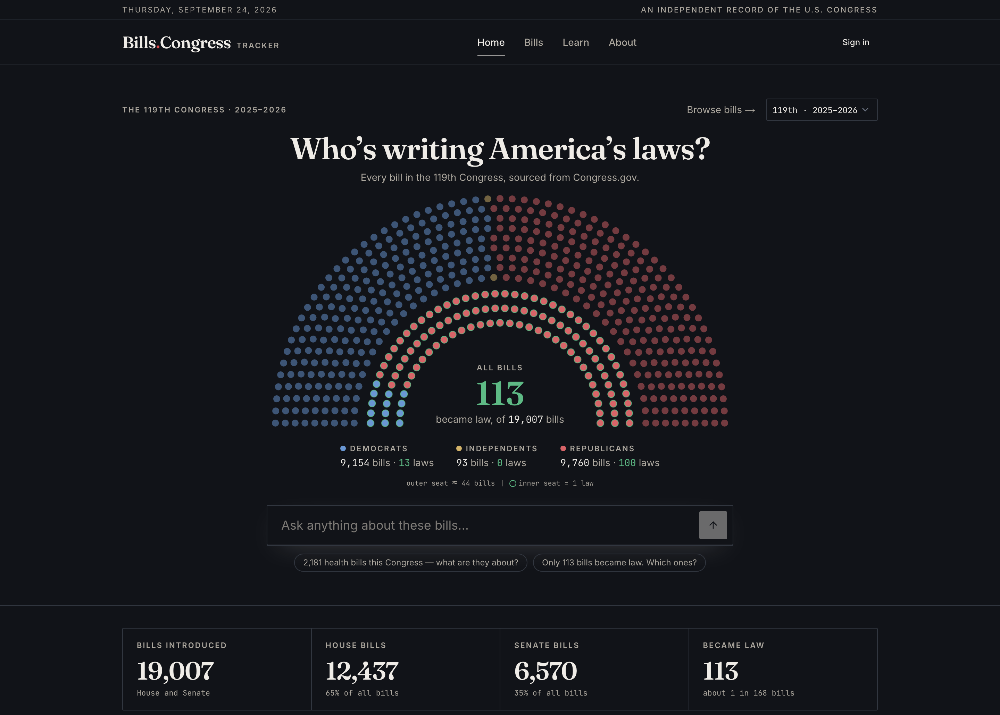

# Bills.Congress

**An independent, open record of every bill in the United States Congress — built from the government's own data and presented so an ordinary person can actually read it.**

Live at **[billsincongress.com](https://billsincongress.com)**



---

## Why this exists

Congress.gov already publishes everything you need to follow legislation. But it is built for legislative staff, not for citizens. Titles are jargon, status codes are cryptic, and you have to know what you are looking for before you can find it.

Bills.Congress takes exactly the same primary data and reorganises it the way a newspaper of record would: clearly indexed, plainly labelled, fast to read, and honest about what it does and does not know.

It is free, has no ads, and you do not need an account to read anything on it.

---

## What's actually on the site

### The front page — one Congress at a glance

The home page is a dashboard for a single Congress at a time (the 119th by default; a picker switches between them). It shows:

- **Four headline counts** — bills introduced, House bills, Senate bills, and how many became law.
- **Where bills stand** — a stacked bar across the legislative pipeline, with each stage's share and count. It is a blunt picture: in the 119th Congress, about 96% of everything introduced is still sitting in committee.
- **Top policy areas** — the subjects Congress is actually spending its time on, ranked.
- **Leading sponsors** — the ten members who introduced the most bills, with party and state.
- **Who's writing the bills** — sponsorship by party and chamber, next to how many of those bills actually became law, so you can see the gap between introducing and passing.
- **Introductions month by month** — bills introduced growing upward, laws signed growing downward, each on its own scale, ending in a written sentence naming the busiest and quietest months.
- **Volume across recent Congresses** — how this Congress compares with the two before it.

Nearly every number on the page is clickable. Click a status segment, a policy area, a sponsor or a state and you land in the bill list already filtered to it.

### Every bill, browsable

`/bills` is the full browser. You can search by title or bill number, start typing a sponsor's name to pick them from a list, and filter by status, Congress, policy area (33 of them), state, date introduced, date last acted on, and bill type.

Every active filter shows as a chip you can remove, and every filter is written into the address bar — so a filtered view can be bookmarked, shared, or walked back through with the browser's Back button. Filters are deliberately *not* remembered between visits, because silently re-applying last week's filters is how people end up staring at an unexplained empty page.

### Forty ways in

Between the front page and roughly 55,600 individual bill pages sit 40 browse pages: two by chamber (House, Senate), five by stage (introduced, in committee, passed one chamber, enacted, vetoed) and 33 by policy topic.

Each one is written as a document, not just a filtered list with a new heading. Every one carries a plain-language explanation of what that grouping actually means — what "in committee" really implies, why most bills stop there, what a concurrent resolution is for.

### A page for every bill

Each bill page shows the bill number and Congress, its policy area, the official title, when it was introduced, who sponsored it (with party and state), and a link to the official PDF where one exists.

Below that:

- **A progress pipeline** showing how far the bill has travelled, from introduced through to law.
- **"At a glance"** — a short plain-language paragraph assembled from the record itself. It contains no invented detail; every clause in it is a field the database actually holds.
- **The official plain-English summary**, when Congress has published one. Summaries are written some time after a bill is introduced, so coverage depends heavily on age: in a live sample of 120 bill pages, every bill checked from the 117th Congress had one, about 4 in 10 from the 118th did not, and about 7 in 10 from the current 119th did not. Where there is none, the page says so in words rather than leaving a blank.
- **Historical context for bills stuck in committee** — how long this one has been there, and what share of past bills that sat that long ever advanced. It is labelled as a description of that group of past bills, not a prediction about this one.

### Ask the record

A question panel opens from the home page, the bills browser and any bill page, and then follows you as you move around the site, so a conversation survives navigation.

It is not a general-purpose chatbot. It answers from this site's own database of Congressional records, and every source it cites is checked against the specific records it was actually shown. See [About the AI](#about-the-ai) below, which is the most important disclosure on this page.

### How Congress works

`/learn` is a hand-built illustrated civics guide for people who never got the classroom version:

- A line drawing of the Capitol that draws itself.
- Real seat charts — all 435 House seats and 100 Senate seats — where picking your state lights up the seats it sends.
- A "100 bills, 3 survive" animation of what actually happens to legislation.
- A seven-step walkthrough from idea to law, each step with its own illustration, a piece of trivia (the House's mahogany "hopper" box; the President's ten-day window), and a note telling you which label that step carries on a real bill page here.
- A five-question quiz that scores you from Campaign Volunteer to Speaker of the House.

### Reading comfort

Light, dark, and follow-your-system themes. A layout that works on a phone. Every animation on the site — including the flag on the home page — respects your operating system's "reduce motion" setting. Keyboard navigation, skip links, and screen-reader labels on the charts and seat diagrams. The bill lists and browse pages are server-rendered as ordinary links, so they still work with JavaScript switched off.

---

## Where the data comes from

Every bill record on this site comes from one place: the **[official Congress.gov API](https://api.congress.gov/)**, a public service of the Library of Congress. There is no scraping, no second provider, and no intermediary. (The one exception on the site is the assistant's clearly labelled web search — see [About the AI](#about-the-ai).)

| | |
| --- | --- |
| **Source** | Congress.gov API v3 (Library of Congress) |
| **Coverage** | The current Congress and the two before it — the 117th, 118th and 119th (2021–2026) |
| **Size** | 55,615 bills and resolutions as of 29 August 2026 |
| **Kinds of legislation** | All eight — House and Senate bills, joint resolutions, concurrent resolutions and simple resolutions |
| **Refresh** | Nightly, with weekly and monthly safety nets |
| **Data rights** | U.S. government work, public domain |
| **Affiliation** | Independent. Not affiliated with, endorsed by, or operated by the U.S. government |

A snapshot of what that holds, taken 29 August 2026:

| Congress | Years | Total | House | Senate | Became law |
| --- | --- | ---: | ---: | ---: | ---: |
| 119th | 2025–26 | 18,472 | 12,005 | 6,467 | 104 |
| 118th | 2023–24 | 19,315 | 12,556 | 6,759 | 274 |
| 117th | 2021–22 | 17,828 | 11,472 | 6,356 | 365 |

### How it stays current

Nine scheduled jobs keep the database in step with Congress:

| When | What it does |
| --- | --- |
| Daily, 01:00 UTC | Pull every bill **in the current Congress** that Congress.gov reports as changed in the last 26 hours |
| Daily, 04:00 UTC | Rebuild the precomputed statistics behind the dashboard |
| Sunday, 02:00 UTC | Re-pull everything in the current Congress changed in the last seven days, as a safety net |
| Monday, 06:00 UTC | Compare the full live list for all three Congresses against ours and fetch anything missing entirely |
| Wednesday, 03:00 UTC | Repair bills that were only half-fetched |
| Friday, 04:30 UTC | Recompute the historical committee statistics shown on bill pages |
| 1st of the month, 05:00 UTC | Re-fetch the current Congress from scratch |
| Twice daily, 01:30 and 13:30 UTC | Tell search engines which bill pages changed |

The sync throttles itself deliberately — three quarters of a second between calls, backing off on rate limits and pausing when Congress.gov's remaining quota runs low. It also skips the bill-record update when nothing a reader would see has changed, so a routine re-pull does not stamp a fake "updated" date on 18,000 bills or announce fake updates to search engines.

The `/bills` page carries a live "Updated *n* hours ago" indicator drawn from the last completed sync.

### What is stored, and what is not

**Held:** a bill's identity and title, its sponsor, the date it was introduced, its action history (up to the 250 actions Congress.gov returns in one page), its official Congressional Research Service summary where one exists, its policy area and legislative subjects, and links to the official PDF and text versions.

**Not held — and the assistant is instructed never to claim otherwise:**

- Co-sponsors. Only the primary sponsor is stored.
- Vote tallies and roll-call results.
- Committee hearing schedules.
- Member biographies, committee assignments or contact details.
- Floor speeches and debate transcripts.
- The full legal text of bills. There is a link to the official PDF, not a copy of it.

### The one number computed here

A bill's position in Congress is **not** a field the government hands out. It is derived here, by reading the bill's action history into an eight-rung ladder:

| Stage | Label |
| ---: | --- |
| 20 | Introduced |
| 40 | In Committee |
| 60 | Passed One Chamber |
| 80 | Passed Both Chambers |
| 85 | Vetoed |
| 90 | To President |
| 95 | Signed by President |
| 100 | Became Law |

That derivation is a judgement, and it is the one place where this site could be wrong in a way Congress.gov is not. It is written down in the open, in [`convex/billStage.ts`](convex/billStage.ts), and it has tests. One example of what it has to handle: the Library of Congress attaches the same action code to both "Signed by President" and "Vetoed by President", which at one point caused real vetoes here to be displayed as bills signed into law.

### The summaries are Congress's own

The plain-English summary on a bill page is written by the **Congressional Research Service**, a nonpartisan government body. It is served here as plain text — the HTML markup is removed and the opening repetition of the bill's own title is trimmed. Nothing else is altered: no rewriting, no condensing, no AI.

---

## About the AI

The question panel is the only place in the interface where a machine writes prose you read. Here is exactly what it does.

**It reads this site's data, not the open internet** — with one labelled exception described below. The model cannot query the database freely. It picks from six curated datasets — bills, actions, official summaries, topics, sponsors and precomputed statistics — and passes filters to lookups written by hand on the server. It never writes a query of its own.

**Invented citations cannot reach you.** Every record handed to the model carries a reference handle. When the answer comes back, every handle it cited is checked against the exact records it was actually given that turn. Anything it made up is deleted from the text before the answer is displayed, and a bill card for a bill that does not exist simply does not render. The number of fabricated citations caught this way is tracked as a health metric. This filters the *citations*, not the sentences around them — the prose can still get something wrong.

**It is told to admit what is missing.** When a lookup returns nothing, the model is instructed to say the site does not hold it, or to run the labelled web search, rather than fall back on general knowledge. It is specifically told never to state co-sponsor counts, vote tallies or hearing schedules. These are prompt instructions, not hard blocks — unlike the citation check, nothing inspects the finished answer for them.

**Web search is a labelled exception.** When the answer genuinely is not in this site's data, the model may search the open web. When it does, it must state in one sentence what is missing here, and that sentence is shown to you word for word. Sources are then printed in two separate blocks: *From our database* and *Not from our database*.

**Your question is never handed to the search engine verbatim.** A search phrase is rejected before it leaves the server if it contains first-person words or simply repeats your question, so the model has to rephrase into a neutral query. Your question text does still go to the AI provider that writes the answer — that is unavoidable — but not to the search engine as you typed it.

**You can see its work.** When an answer involved lookups, it shows a log of them.

**The model itself:** DeepSeek V4 Flash, reached through OpenRouter. Requests carry zero-retention and no-training flags, a maximum price per million tokens so a repriced provider is skipped rather than silently billed, and an automatic failover chain if the primary is unavailable. Routing is pinned to a short allowlist of providers chosen for US data processing — OpenRouter's true region-locking is an enterprise feature, so this is an allowlist, not a hard geographic guarantee.

**Limits:** five questions a day without an account, 100 with one. Questions are capped at 2,000 characters.

**And the honest part:** AI answers can still be incomplete, outdated, or plainly wrong. The grounding machinery makes fabricated *sources* very hard, but it does not make the prose correct. Treat any answer as a starting point and click through to the record. For anything official, use Congress.gov.

---

## What is collected about you

The full detail is in the [Privacy Policy](https://billsincongress.com/privacy). The short version:

- **Product analytics run on every page** (PostHog, US cloud) — pages visited, clicks, performance, errors, and session replay. There is currently no cookie banner and no opt-out control on the site.
- **The text of questions you ask the assistant is included in that analytics data.**
- **If you are not signed in, your conversation in the Ask panel is never stored.** It lives in the page and disappears when you leave. To be precise: each question is sent to the server along with the conversation so far, so the assistant can follow the thread — that part is unavoidable — but none of it is written to the database. The table that holds saved conversations requires an account, so an anonymous one cannot be recorded even by mistake. You are also issued a 60-day cookie holding a random ID, which is how the five-a-day limit is counted.
- **If you sign in, conversations are saved to your account**, visible only to you, and you can delete them one at a time or all at once. Signing in also links your analytics activity to your account, including your email address.
- **No IP addresses are stored in this site's own database.**
- **Nothing is sold, and there are no ads or advertising trackers.**

An account is free and gets you three things today: bookmarking bills, saved conversation history, and the higher daily question allowance. There is no paid tier and no payment information is collected. Account deletion is handled by emailing **hi@billsincongress.com** — there is no self-serve delete button yet.

---

## Open by default

- **The code** is all here, MIT licensed. Every data transformation, every prompt, every guardrail.
- **The data** is public domain, published by the U.S. government. If you want it in bulk, take it from [Congress.gov](https://api.congress.gov/) directly rather than scraping this site.
- **The sitemap** lists every bill page — 55,000-plus URLs, split one file per Congress — so search engines can reach every bill rather than the handful a crawler could find by clicking.
- **[`/llms.txt`](https://billsincongress.com/llms.txt)** tells AI systems what this site is, how its URLs are built, and asks them to cite it with a link.
- **Crawler policy:** bots that answer someone's question and link back — ChatGPT search, Perplexity, Google, Bing, Apple — are welcome. Eighteen named crawlers that harvest content to train models are blocked in `robots.txt`. That is a request, not enforcement; it depends on the crawler honouring it.

---

## Known limits

Stated plainly, because they affect what you can trust:

- **Coverage stops at the 117th Congress.** Anything older is not here. A bill missing from a search is not evidence it does not exist.
- **A filtered list can show far fewer bills than it says it found.** The browse query gives up after scanning 1,200 records, so a narrow filter runs out early while the count above it reports the true total. Filtering the 119th Congress by Wyoming sponsors reports 161 bills and returns a handful. The counts are right; the lists behind them are not always complete. Search and the sitemap are the reliable ways to reach a specific bill.
- **Browsing is depth-capped** even without a filter — roughly 510 results on `/bills`, 500 on a browse page.
- **Search matches titles and bill numbers only**, never the text of a bill. A bill about a subject whose title does not mention it will not turn up that way.
- **Older Congresses are not actively refreshed.** The nightly, weekly and monthly jobs track the current Congress only; the Monday reconciliation adds bills that were never synced but does not re-check ones already stored. An upstream correction to a 2022 bill may not be picked up.
- **There is no documented or supported public API and no bulk download.** The backend does answer read-only bill queries without a key — that is what makes a local clone show real data — but it is not a supported interface and may change without notice. For bulk data, use Congress.gov.
- **There is no notification or "follow this bill" feature**, despite what the sign-in page says. That copy is stale.
- **Password reset is not self-serve yet.** Email hi@billsincongress.com and it gets done by hand.
- **Sign-up, sign-in, the account page and the user menu all mention a "Pro" plan.** It does not exist, nothing is for sale, and the site is free.

If you spot something wrong, that is the most useful thing you can send. See below.

---

## How it's built

Not because you need to run it — nobody is expected to host their own copy — but because "you can read the code" only means something if the map is included.

| Layer | What it is |
| --- | --- |
| Frontend | Next.js 16 (App Router), React 19, TypeScript |
| Styling | Tailwind CSS, shadcn/ui, Framer Motion |
| Backend | Convex — database, queries, scheduled jobs, and the answer stream |
| Accounts | Convex Auth: Google sign-in, or email and password with a one-time code sent via Resend |
| AI | OpenRouter, with the grounding and citation-checking layer in `convex/catalog/` and `convex/answer.ts` |
| Hosting | Cloudflare Workers via OpenNext, with Convex Cloud for the backend |
| Analytics | PostHog |

```
Congress.gov API
      ↓   nine scheduled jobs (convex/crons.ts)
Sync and repair (convex/congressApi.ts, convex/sync.ts)
      ↓
Convex database (convex/schema.ts) + precomputed statistics
      ↓
Queries (convex/bills.ts)          Grounded answers (convex/answer.ts, convex/catalog/)
      ↓                                        ↓
        Next.js App Router (app/) → Cloudflare Workers
```

Heavy analytics are never computed on page load. They are rebuilt overnight into dedicated tables so the dashboard reads a handful of rows instead of scanning 18,000 bills. That decision, and the reasoning behind it, is written up in [`Documentation/interactive-dashboard.md`](Documentation/interactive-dashboard.md).

The repository uses **pnpm**. `pnpm test` runs the test suite plus two repository-wide safety checks — one that stops any public backend function from accepting a user ID as an argument, and one that stops any publicly reachable path to the AI model from shipping without a rate limit. Both exist because of a real mistake. `pnpm cf:build` is the production build. Every pull request runs both, plus an automated code review, before it can merge.

To run it locally:

```bash
git clone https://github.com/shreyashguptas/billsincongress.git
cd billsincongress
pnpm install
cp .env.example .env.local
pnpm dev
```

The Convex URL in `.env.example` points at the **live production backend**, so a fresh clone shows real data straight away — and the AI panel and sign-in work too, because their credentials live on that deployment. That also means a local clone spends real AI budget and creates real accounts. Point `NEXT_PUBLIC_CONVEX_URL` at your own Convex deployment if you would rather develop against your own.

More detail lives in [`Documentation/`](Documentation) — an architecture overview, the dashboard deep-dive, and the analytics event registry.

---

## Corrections and contributions

If something on the site is wrong — a bill's status, a summary, a label, a broken page — **please [open an issue](https://github.com/shreyashguptas/billsincongress/issues)**. You do not need to know how to code. What you saw and what you expected is enough, and a correction is worth more here than a feature.

Code contributions are welcome too. Branch from `main`, run `pnpm test` and `pnpm cf:build`, and open a pull request describing what changed and why.

Anything else: **hi@billsincongress.com**.

---

## Independence and licensing

Bills.Congress is a public-interest project operated by Shreyash Gupta. It is **not affiliated with, endorsed by, or operated by the United States government**. It is an educational and informational resource — nothing on it is legal or professional advice, and for official purposes you should rely on Congress.gov.

The legislative data is a work of the U.S. government and is in the public domain. The source code is released under the [MIT License](LICENSE) — free to use, copy, modify and distribute, including commercially.
