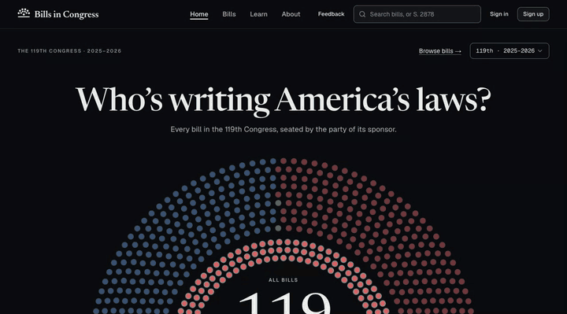

# Bills in Congress

**Every bill in the United States Congress, from the government's own data, written so an ordinary person can read it.**

Live at **[billsincongress.com](https://billsincongress.com)**

## What it does

- **Browse every bill** from the 117th Congress onward (2021 to today), filtered by status, sponsor, state, topic and date.
- **Read one bill on one page**: where it stands, how it got there, the official summary, and how it compares with every other bill on the same topic.
- **Ask questions** about bills in plain English. Answers come from the site's own records, with checked sources.
- **Follow bills** on the optional Pro plan ($5 a month) and get an email when one moves.

It is free to read, has no ads, and needs no account.

## Good to know

- **Data:** every bill record comes from the official [Congress.gov API](https://api.congress.gov/) (Library of Congress), refreshed nightly. Bill summaries are written by the Congressional Research Service, not by AI.
- **AI:** the question panel uses an AI model (OpenAI's open-weight gpt-oss-120b through OpenRouter). Its citations are checked against real records, but its wording can still be wrong. Check anything important on Congress.gov.
- **Tracking:** the site uses PostHog for analytics and session replay, and the text of questions you ask is recorded there. There is no cookie banner and no opt-out. Nothing is sold. Details in the [privacy policy](https://billsincongress.com/privacy).
- **Accounts:** optional (Google, or email and password). Signing in saves bills and conversations and raises the daily question limit.
- **Independent:** run by OffGrid LLC. Not affiliated with the U.S. government, and not legal advice.

## More

- [Reader guide](documentation/reader-guide.md): everything the site does, where the data comes from, what the AI does, what is collected, and the known limits.
- [Architecture and operations](documentation/overview.md), [design language](documentation/brand.md), [analytics events](documentation/analytics.md), [home-page dashboard](documentation/interactive-dashboard.md).

Something wrong? Tap **No** under a wrong answer, [open an issue](https://github.com/shreyashguptas/billsincongress/issues), or email **hi@billsincongress.com**.

A local clone (`pnpm install`, copy `.env.example` to `.env.local`, `pnpm dev`) talks to the **live production backend** through the Convex URL in `.env.example`, so it spends real AI budget and creates real accounts.

The code is [MIT licensed](LICENSE). The legislative data is a U.S. government work in the public domain.
